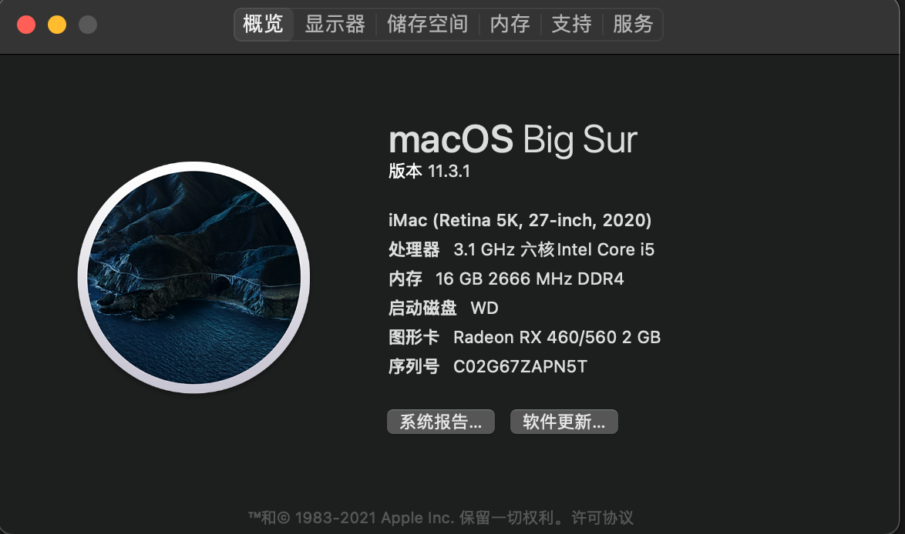
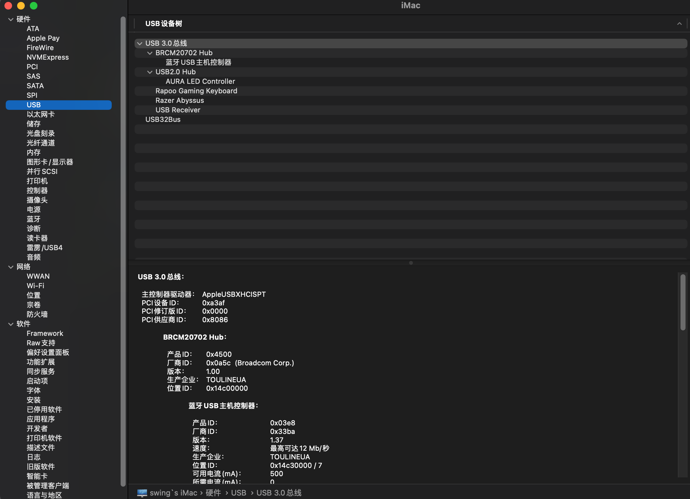

# ROG-B460I-EFI

OpenCore EFI for Asus ROG B460I

# Before Using

- **_PLEASE ADD YOUR `SMBIOS` BEFORE USING_**
- change the ig-platform-id to `07009B3E` if you use iGPU to drive monitor. [check this](https://dortania.github.io/OpenCore-Install-Guide/config.plist/comet-lake.html#deviceproperties)

# BIOS Settings

waiting add

# Spec

- CPU: Intel I5 10500
- dGPU: AMD RX560 2G
- WiFi Card: BCM94360Z4

# What Works

- Intel Graph Card
- Hand off
- Side by
- Hibernate
- USB ports (USB3 Gen2 not testing)
- Bluetooth
- System Online Upgrade
- iCloud and photos

# Issues

- iMessage not working, but you can check [this](https://dortania.github.io/OpenCore-Post-Install/universal/iservices.html) article to fix it

# Screens

